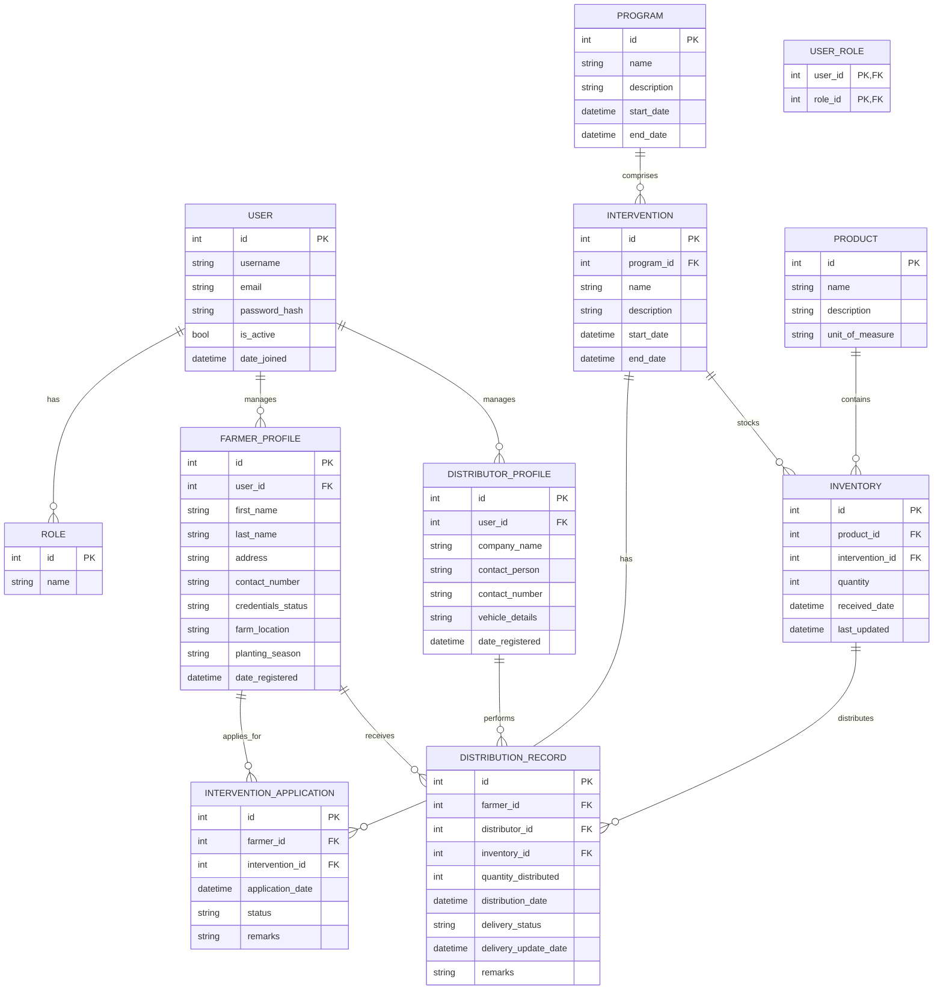

# Bauang Agricultural Trade Center Distribution Management System: Full Structure Plan

## 1. Introduction

This document outlines the comprehensive structure plan for the Bauang Agricultural Trade Center Distribution Management System (DMS). The system aims to centralize and improve the distribution of agricultural products, monitor stock levels, and maintain accurate records of farmers and their participation in government interventions. The system will not include a purchase module, as products are derived from government intervention programs. A key focus is also on providing a mobile-responsive interface for distributors to update delivery statuses efficiently.

## 2. System Architecture

### Overview
The system is a centralized agricultural product distribution and management platform designed for the Bauang Agricultural Trade Center. It focuses on inventory monitoring, farmer record-keeping, and distribution tracking without a purchase module, as products are sourced from government interventions.

### Technology Stack
- **Frontend:** React with Vite, TypeScript, Tailwind CSS.
- **Backend:** Django (Python) with Django REST Framework (DRF).
- **Database:** PostgreSQL (recommended for robust relational data).
- **Authentication:** JWT (JSON Web Tokens) for secure API access.

### Core Modules
1.  **User Management & Access Control (RBAC)**
    -   Roles: Admin, Staff, Farmer, Distributor.
    -   Permissions: Staff assigned to specific programs/interventions.
2.  **Farmer Management**
    -   Profile management, planting season updates, intervention applications.
3.  **Inventory Management**
    -   Real-time monitoring of stocks received from government programs.
4.  **Distribution & Intervention Tracking**
    -   Assignment of interventions to farmers, distributor assignments, and status updates.
5.  **Mobile-Responsive Interface**
    -   Optimized for distributors/truck delivery to update status on the go.

### User Roles & Capabilities
| Role | Capabilities |
| :--- | :--- |
| **Admin** | Full system access, user management, program creation, inventory oversight. |
| **Staff** | Manage assigned programs, verify farmer credentials, approve intervention applications. |
| **Farmer** | Update personal/farm profile, change planting season, apply for interventions. |
| **Distributor** | View assigned distributions (farmer, item, location), update delivery status. |

## 3. Database Schema

This section outlines the proposed database schema, detailing the tables, their fields, and relationships. The design prioritizes data integrity, scalability, and efficient retrieval for the identified core modules.

### Entity-Relationship Diagram (Conceptual)



### Table Details

#### `User` Table
Stores core user authentication information. This will leverage Django's built-in `User` model.

| Field Name | Data Type | Constraints | Description |
| :--------- | :-------- | :---------- | :---------- |
| `id`       | Integer   | Primary Key | Unique identifier for the user. |
| `username` | String    | Unique      | User's login username. |
| `email`    | String    | Unique      | User's email address. |
| `password` | String    |             | Hashed password. |
| `is_active`| Boolean   |             | Indicates if the user account is active. |
| `date_joined`| DateTime  |             | Timestamp when the user joined. |

#### `Role` Table
Defines the different user roles within the system.

| Field Name | Data Type | Constraints | Description |
| :--------- | :-------- | :---------- | :---------- |
| `id`       | Integer   | Primary Key | Unique identifier for the role. |
| `name`     | String    | Unique      | Name of the role (e.g., 'Admin', 'Staff', 'Farmer', 'Distributor'). |

#### `UserRole` Table (Junction Table)
Links users to their respective roles, allowing for multiple roles per user if needed.

| Field Name | Data Type | Constraints | Description |
| :--------- | :-------- | :---------- | :---------- |
| `user_id`  | Integer   | Foreign Key | References `User.id`. |
| `role_id`  | Integer   | Foreign Key | References `Role.id`. |

#### `FarmerProfile` Table
Stores specific details for users with the 'Farmer' role.

| Field Name | Data Type | Constraints | Description |
| :--------- | :-------- | :---------- | :---------- |
| `id`       | Integer   | Primary Key | Unique identifier for the farmer profile. |
| `user_id`  | Integer   | Foreign Key | References `User.id`. |
| `first_name`| String    |             | Farmer's first name. |
| `last_name`| String    |             | Farmer's last name. |
| `address`  | String    |             | Farmer's physical address. |
| `contact_number`| String |             | Farmer's contact number. |
| `credentials_status`| String |             | Status of farmer's credentials (e.g., 'Verified', 'Pending', 'Rejected'). |
| `farm_location`| String |             | Location of the farmer's farm. |
| `planting_season`| String |             | Current or planned planting season. |
| `date_registered`| DateTime |             | Date when the farmer profile was registered. |

#### `DistributorProfile` Table
Stores specific details for users with the 'Distributor' role.

| Field Name | Data Type | Constraints | Description |
| :--------- | :-------- | :---------- | :---------- |
| `id`       | Integer   | Primary Key | Unique identifier for the distributor profile. |
| `user_id`  | Integer   | Foreign Key | References `User.id`. |
| `company_name`| String |             | Distributor's company name. |
| `contact_person`| String |             | Main contact person for the distributor. |
| `contact_number`| String |             | Distributor's contact number. |
| `vehicle_details`| String |             | Details about the distributor's vehicles. |
| `date_registered`| DateTime |             | Date when the distributor profile was registered. |

#### `Program` Table
Defines the government agricultural programs.

| Field Name | Data Type | Constraints | Description |
| :--------- | :-------- | :---------- | :---------- |
| `id`       | Integer   | Primary Key | Unique identifier for the program. |
| `name`     | String    | Unique      | Name of the program. |
| `description`| Text     |             | Detailed description of the program. |
| `start_date`| Date     |             | Start date of the program. |
| `end_date` | Date     |             | End date of the program. |

#### `Intervention` Table
Details specific interventions within a program, which are tied to product distribution.

| Field Name | Data Type | Constraints | Description |
| :--------- | :-------- | :---------- | :---------- |
| `id`       | Integer   | Primary Key | Unique identifier for the intervention. |
| `program_id`| Integer   | Foreign Key | References `Program.id`. |
| `name`     | String    |             | Name of the intervention. |
| `description`| Text     |             | Description of the intervention. |
| `start_date`| Date     |             | Start date of the intervention. |
| `end_date` | Date     |             | End date of the intervention. |

#### `InterventionApplication` Table
Records farmer applications to specific interventions.

| Field Name | Data Type | Constraints | Description |
| :--------- | :-------- | :---------- | :---------- |
| `id`       | Integer   | Primary Key | Unique identifier for the application. |
| `farmer_id`| Integer   | Foreign Key | References `FarmerProfile.id`. |
| `intervention_id`| Integer | Foreign Key | References `Intervention.id`. |
| `application_date`| DateTime |             | Date when the application was submitted. |
| `status`   | String    |             | Status of the application (e.g., 'Pending', 'Approved', 'Rejected'). |
| `remarks`  | Text      |             | Any additional remarks for the application. |

#### `Product` Table
Catalog of agricultural products.

| Field Name | Data Type | Constraints | Description |
| :--------- | :-------- | :---------- | :---------- |
| `id`       | Integer   | Primary Key | Unique identifier for the product. |
| `name`     | String    | Unique      | Name of the product (e.g., 'Rice Seeds', 'Fertilizer'). |
| `description`| Text     |             | Description of the product. |
| `unit_of_measure`| String |             | Unit of measure (e.g., 'kg', 'bag', 'sack'). |

#### `Inventory` Table
Tracks the stock of products received for specific interventions.

| Field Name | Data Type | Constraints | Description |
| :--------- | :-------- | :---------- | :---------- |
| `id`       | Integer   | Primary Key | Unique identifier for the inventory record. |
| `product_id`| Integer   | Foreign Key | References `Product.id`. |
| `intervention_id`| Integer | Foreign Key | References `Intervention.id`. |
| `quantity` | Integer   |             | Current quantity of the product in stock for this intervention. |
| `received_date`| DateTime |             | Date when the stock was received. |
| `last_updated`| DateTime |             | Last date the inventory record was updated. |

#### `DistributionRecord` Table
Records the actual distribution of products to farmers by distributors.

| Field Name | Data Type | Constraints | Description |
| :--------- | :-------- | :---------- | :---------- |
| `id`       | Integer   | Primary Key | Unique identifier for the distribution record. |
| `farmer_id`| Integer   | Foreign Key | References `FarmerProfile.id`. |
| `distributor_id`| Integer | Foreign Key | References `DistributorProfile.id`. |
| `inventory_id`| Integer | Foreign Key | References `Inventory.id`. |
| `quantity_distributed`| Integer |             | Quantity of product distributed. |
| `distribution_date`| DateTime |             | Date of distribution. |
| `delivery_status`| String |             | Status of delivery (e.g., 'Pending', 'Delivered', 'Delayed', 'Rescheduled'). |
| `delivery_update_date`| DateTime |             | Last date the delivery status was updated. |
| `remarks`  | Text      |             | Any additional remarks regarding the distribution. |

## 4. Backend API Endpoints and Module Structure

This section details the proposed API endpoints for the system, following RESTful principles, and outlines the backend module structure using Django and Django REST Framework (DRF).

### API Endpoints

#### Authentication & Authorization
| Endpoint | Method | Description | Permissions |
| :------- | :----- | :---------- | :---------- |
| `/api/auth/register/` | `POST` | Register a new user (Staff, Farmer, Distributor). | Public |
| `/api/auth/login/` | `POST` | Obtain JWT token. | Public |
| `/api/auth/refresh/` | `POST` | Refresh JWT token. | Authenticated |
| `/api/auth/me/` | `GET` | Get current user details. | Authenticated |

#### User Management (Admin/Staff)
| Endpoint | Method | Description | Permissions |
| :------- | :----- | :---------- | :---------- |
| `/api/users/` | `GET` | List all users. | Admin, Staff |
| `/api/users/<id>/` | `GET` | Retrieve user details. | Admin, Staff |
| `/api/users/<id>/` | `PUT` | Update user details. | Admin, Staff |
| `/api/users/<id>/` | `DELETE` | Delete user. | Admin |
| `/api/roles/` | `GET` | List all roles. | Admin |
| `/api/users/<id>/assign_role/` | `POST` | Assign role to user. | Admin |

#### Farmer Management
| Endpoint | Method | Description | Permissions |
| :------- | :----- | :---------- | :---------- |
| `/api/farmers/` | `GET` | List all farmer profiles. | Admin, Staff |
| `/api/farmers/` | `POST` | Create new farmer profile. | Staff |
| `/api/farmers/<id>/` | `GET` | Retrieve farmer profile. | Admin, Staff, Farmer (self) |
| `/api/farmers/<id>/` | `PUT` | Update farmer profile. | Admin, Staff, Farmer (self) |
| `/api/farmers/<id>/credentials/verify/` | `POST` | Verify farmer credentials. | Staff |
| `/api/farmers/<id>/applications/` | `GET` | List farmer's intervention applications. | Admin, Staff, Farmer (self) |
| `/api/farmers/<id>/applications/` | `POST` | Apply for an intervention. | Farmer (self) |

#### Distributor Management
| Endpoint | Method | Description | Permissions |
| :------- | :----- | :---------- | :---------- |
| `/api/distributors/` | `GET` | List all distributor profiles. | Admin, Staff |
| `/api/distributors/` | `POST` | Create new distributor profile. | Admin |
| `/api/distributors/<id>/` | `GET` | Retrieve distributor profile. | Admin, Staff, Distributor (self) |
| `/api/distributors/<id>/` | `PUT` | Update distributor profile. | Admin, Staff, Distributor (self) |
| `/api/distributors/<id>/distributions/` | `GET` | List assigned distributions. | Admin, Staff, Distributor (self) |
| `/api/distributors/<id>/distributions/<dist_id>/status/` | `PUT` | Update delivery status. | Distributor (self) |

#### Program & Intervention Management
| Endpoint | Method | Description | Permissions |
| :------- | :----- | :---------- | :---------- |
| `/api/programs/` | `GET` | List all programs. | All Authenticated |
| `/api/programs/` | `POST` | Create new program. | Admin |
| `/api/programs/<id>/` | `GET` | Retrieve program details. | All Authenticated |
| `/api/programs/<id>/` | `PUT` | Update program details. | Admin |
| `/api/programs/<id>/interventions/` | `GET` | List interventions for a program. | All Authenticated |
| `/api/interventions/` | `POST` | Create new intervention. | Admin |
| `/api/interventions/<id>/` | `GET` | Retrieve intervention details. | All Authenticated |
| `/api/interventions/<id>/` | `PUT` | Update intervention details. | Admin |

#### Inventory Management
| Endpoint | Method | Description | Permissions |
| :------- | :----- | :---------- | :---------- |
| `/api/products/` | `GET` | List all products. | Admin, Staff |
| `/api/products/` | `POST` | Create new product. | Admin |
| `/api/products/<id>/` | `GET` | Retrieve product details. | Admin, Staff |
| `/api/products/<id>/` | `PUT` | Update product details. | Admin |
| `/api/inventory/` | `GET` | List all inventory records. | Admin, Staff |
| `/api/inventory/` | `POST` | Add new inventory stock. | Admin, Staff |
| `/api/inventory/<id>/` | `GET` | Retrieve inventory record. | Admin, Staff |
| `/api/inventory/<id>/` | `PUT` | Update inventory record. | Admin, Staff |

#### Distribution Records
| Endpoint | Method | Description | Permissions |
| :------- | :----- | :---------- | :---------- |
| `/api/distributions/` | `GET` | List all distribution records. | Admin, Staff |
| `/api/distributions/` | `POST` | Create new distribution record. | Staff |
| `/api/distributions/<id>/` | `GET` | Retrieve distribution record. | Admin, Staff, Distributor (assigned) |
| `/api/distributions/<id>/` | `PUT` | Update distribution record. | Admin, Staff, Distributor (assigned) |

### Backend Module Structure (Django)

The Django backend will be structured into several apps, each responsible for a specific domain, promoting modularity and maintainability.

```
backend/
├── project_name/
│   ├── settings.py
│   ├── urls.py
│   └── wsgi.py
├── apps/
│   ├── users/
│   │   ├── models.py (User, Role, UserRole)
│   │   ├── serializers.py
│   │   ├── views.py (User, Role, Auth views)
│   │   └── urls.py
│   ├── farmers/
│   │   ├── models.py (FarmerProfile, InterventionApplication)
│   │   ├── serializers.py
│   │   ├── views.py (FarmerProfile, InterventionApplication views)
│   │   └── urls.py
│   ├── distributors/
│   │   ├── models.py (DistributorProfile)
│   │   ├── serializers.py
│   │   ├── views.py (DistributorProfile views)
│   │   └── urls.py
│   ├── programs/
│   │   ├── models.py (Program, Intervention)
│   │   ├── serializers.py
│   │   ├── views.py (Program, Intervention views)
│   │   └── urls.py
│   ├── inventory/
│   │   ├── models.py (Product, Inventory)
│   │   ├── serializers.py
│   │   ├── views.py (Product, Inventory views)
│   │   └── urls.py
│   └── distributions/
│       ├── models.py (DistributionRecord)
│       ├── serializers.py
│       ├── views.py (DistributionRecord views)
│       └── urls.py
└── manage.py
```

### Key Components:
-   **`project_name/settings.py`**: Global Django settings, database configuration, installed apps, JWT settings.
-   **`project_name/urls.py`**: Main URL router, including paths to individual app URLs.
-   **`apps/` directory**: Contains all custom Django applications.
    -   **`models.py`**: Defines database models using Django ORM.
    -   **`serializers.py`**: Converts complex data types (Django models) to native Python datatypes that can be easily rendered into JSON/XML, and vice versa for DRF.
    -   **`views.py`**: Contains API viewsets and views, handling request/response logic and interacting with serializers and models.
    -   **`urls.py`**: Defines URL patterns for each app, routing requests to appropriate views.

## 5. Frontend Module Structure and UI Components

This section outlines the proposed frontend module structure using React with Vite, TypeScript, and Tailwind CSS, along with key UI components and routing.

### Project Structure

```
frontend/
├── public/
│   └── vite.svg
├── src/
│   ├── assets/
│   │   └── react.svg
│   ├── components/
│   │   ├── common/
│   │   │   ├── Button.tsx
│   │   │   ├── InputField.tsx
│   │   │   ├── Table.tsx
│   │   │   └── Modal.tsx
│   │   ├── auth/
│   │   │   ├── LoginForm.tsx
│   │   │   └── RegisterForm.tsx
│   │   ├── farmers/
│   │   │   ├── FarmerProfileCard.tsx
│   │   │   └── InterventionApplicationForm.tsx
│   │   ├── distributors/
│   │   │   ├── DistributorProfileCard.tsx
│   │   │   └── DistributionUpdateForm.tsx
│   │   ├── inventory/
│   │   │   ├── InventoryTable.tsx
│   │   │   └── ProductForm.tsx
│   │   └── programs/
│   │       ├── ProgramCard.tsx
│   │       └── InterventionForm.tsx
│   ├── hooks/
│   │   ├── useAuth.ts
│   │   └── useApi.ts
│   ├── layouts/
│   │   ├── AuthLayout.tsx
│   │   ├── DashboardLayout.tsx
│   │   └── MobileLayout.tsx
│   ├── pages/
│   │   ├── auth/
│   │   │   ├── LoginPage.tsx
│   │   │   └── RegisterPage.tsx
│   │   ├── admin/
│   │   │   ├── DashboardPage.tsx
│   │   │   ├── UserManagementPage.tsx
│   │   │   ├── ProgramManagementPage.tsx
│   │   │   └── InventoryManagementPage.tsx
│   │   ├── staff/
│   │   │   ├── DashboardPage.tsx
│   │   │   ├── FarmerVerificationPage.tsx
│   │   │   └── DistributionAssignmentPage.tsx
│   │   ├── farmer/
│   │   │   ├── FarmerDashboardPage.tsx
│   │   │   ├── ProfilePage.tsx
│   │   │   └── ApplyInterventionPage.tsx
│   │   ├── distributor/
│   │   │   ├── DistributorDashboardPage.tsx
│   │   │   └── DeliveryStatusPage.tsx
│   │   └── NotFoundPage.tsx
│   ├── services/
│   │   ├── auth.ts
│   │   ├── farmers.ts
│   │   ├── distributors.ts
│   │   ├── programs.ts
│   │   ├── inventory.ts
│   │   └── distributions.ts
│   ├── store/
│   │   └── index.ts (e.g., Zustand or Redux store)
│   ├── types/
│   │   └── index.ts (TypeScript interfaces and types)
│   ├── utils/
│   │   └── helpers.ts
│   ├── App.tsx
│   ├── main.tsx
│   └── index.css (Tailwind CSS)
├── tsconfig.json
├── vite.config.ts
└── package.json
```

### Key UI Components

#### Common Components (`src/components/common/`)
-   **`Button.tsx`**: Reusable button component with various styles (primary, secondary, danger).
-   **`InputField.tsx`**: Generic input field component for text, numbers, etc., with validation support.
-   **`Table.tsx`**: Component for displaying tabular data, with sorting and pagination capabilities.
-   **`Modal.tsx`**: Reusable modal dialog for confirmations, forms, or detailed views.
-   **`Dropdown.tsx`**: For selection of options (e.g., roles, statuses).
-   **`LoadingSpinner.tsx`**: Visual indicator for data loading.

#### Authentication Components (`src/components/auth/`)
-   **`LoginForm.tsx`**: Handles user login with username/email and password.
-   **`RegisterForm.tsx`**: For new user registration (e.g., staff creating farmer/distributor accounts).

#### Role-Specific Components (`src/components/{role}/`)
-   **`FarmerProfileCard.tsx`**: Displays farmer's credentials and farm details.
-   **`InterventionApplicationForm.tsx`**: Form for farmers to apply for interventions.
-   **`DistributorProfileCard.tsx`**: Displays distributor's company and vehicle details.
-   **`DistributionUpdateForm.tsx`**: For distributors to update delivery status.
-   **`InventoryTable.tsx`**: Displays current stock levels and product information.
-   **`ProgramCard.tsx`**: Displays program and intervention details.

### Routing

React Router will be used for navigation, with protected routes based on user roles.

-   **Public Routes**: `/login`, `/register`
-   **Admin Routes**: `/admin/dashboard`, `/admin/users`, `/admin/programs`, `/admin/inventory`
-   **Staff Routes**: `/staff/dashboard`, `/staff/farmers/verify`, `/staff/distributions/assign`
-   **Farmer Routes**: `/farmer/dashboard`, `/farmer/profile`, `/farmer/interventions/apply`
-   **Distributor Routes**: `/distributor/dashboard`, `/distributor/deliveries`

### State Management

A lightweight state management library like Zustand or a more robust one like Redux Toolkit will be used to manage global application state, including user authentication status, notifications, and shared data.

### API Integration

-   **`src/services/`**: Contains functions for interacting with the Django backend API, abstracting API calls.
-   **`useApi.ts` hook**: A custom hook to handle API requests, loading states, and error handling.

### Styling

Tailwind CSS will be used for utility-first styling, enabling rapid UI development and consistent design. Custom themes and components will be built on top of Tailwind. Mobile-responsive design will be a priority, especially for the distributor interface.
